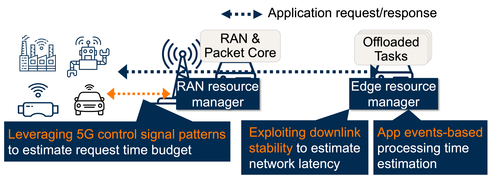

<div align="center">
  
  <h1 style="font-size: 1.2rem; margin-bottom: 0px">SLO-Aware Cellular Multi-Access Edge Computing for Real-Time Interactive Applications</h1>
</div>


<div align="center" style="max-width: 980px; margin: 0.75rem auto 0; padding: 0 16px">
  <p style="margin: 0; font-size: 1.05rem; line-height: 1.6">
    Practical, SLO-aware resource management for 5G multi-access edge computing
  </p>
</div>

<div align="center" style="max-width: 980px; margin: 1rem auto 1.25rem; padding: 0 16px">
  <!--
  <div style="font-size: 1rem; line-height: 1.35">
    <strong><a href="https://timez-zx.github.io/">Xiao Zhang</a></strong> · <strong><a href="https://daehyeok.kim">Daehyeok Kim</a></strong>
  </div>
  <div style="font-size: 0.92rem; color: #6b7280; line-height: 1.35">
    The University of Texas at Austin
  </div>
  -->
  <div style="display: flex; flex-wrap: wrap; gap: 10px; justify-content: center; margin-top: 0.85rem">
    <a href="https://github.com/smec-project" class="md-button md-button--primary">GitHub</a>
    <a href="https://daehyeok.kim/assets/papers/smec-nsdi26.pdf" class="md-button">NSDI'26 Paper</a>
  </div>
</div>

<figure markdown>


<figcaption style="text-align: center; margin-top: 12px; color: #6b7280">SMEC system architecture overview and key ideas </figcaption>

</figure>

Real-time interactive applications, including AI-based video transformation, XR/AR/VR rendering offload, cloud gaming, remote robot teleoperation, and real-time video analytics, depend on low and predictable end-to-end latency.
5G/6G [multi-access edge computing (MEC)](https://en.wikipedia.org/wiki/Multi-access_edge_computing) is designed to deliver this by placing compute close to users.
Yet our measurements on commercial deployments reveal a different reality: **high tail latencies frequently violate application SLOs**.
The root cause is resource contention at both the RAN and edge servers, compounded by schedulers that lack SLO awareness.
Existing solutions require tight coordination between RAN and edge, which is impractical when different entities operate each component (e.g., Verizon runs the RAN while AWS provides edge compute).
Even if such coordination were feasible, feedback delays prevent timely resource allocation.

**SMEC takes a different approach:** it brings SLO-aware scheduling to MEC through **completely decoupled** resource managers at the RAN and edge, each making deadline-aware decisions independently.

Our core insight is that standard 5G protocols and MEC application behaviors already expose the signals needed for SLO-aware scheduling <strong>without requiring RAN-edge coordination</strong>.
SMEC exploits these readily available signals through three key ideas:

1. **Exploiting 5G control signals for request identification at the RAN**: Standard 5G control signaling between UE and base station naturally exhibits distinctive patterns when new application requests are generated. SMEC leverages them to detect request boundaries at the RAN without payload inspection or protocol modifications.
2. **Leveraging downlink stability for network latency estimation at the edge**: 5G downlink transmissions exhibit more predictable latency than uplink. SMEC exploits this asymmetry through a lightweight probing protocol between edge servers and client devices, enabling accurate latency tracking without RAN-edge coordination.
3. **Utilizing application lifecycle events for processing time prediction at the edge**: MEC applications' request-response behaviors expose key lifecycle events that enable processing time estimation. SMEC tracks these naturally occurring events through server-side APIs and builds execution history, providing sufficient accuracy for deadline-aware scheduling without requiring invasive application changes.


<style>
.smec-summary-cards > ul > li {
  background-color: #fafafa;
}
</style>

<div class="grid cards smec-summary-cards" markdown>

-   **Open-source Implementation**

    ---

    **RAN resource manager**: Pluggable scheduling module for srsRAN's MAC layer

    **Edge resource manager**: User-space daemon managing CPU and GPU resources with lightweight client-side timing daemon


-   **Evaluation Highlights**

    ---

    **90–96% SLO satisfaction** across real-world latency-critical applications with SLO requirements ranging from 10s to 100 milliseconds

    **Starvation-free** for best-effort applications sharing remaining bandwidth


</div>

***
## Target Applications

SMEC targets real-time interactive applications offloaded to MEC servers over 5G, where end-to-end latency directly impacts user experience or task correctness.

<div class="grid cards" markdown>

-   **AI-Based Video Transformation**

    ---

    Real-time style transfer, super-resolution, and background removal must process each video frame within a strict per-frame deadline; missed deadlines cause visible stutter or degraded output quality.

-   **XR / AR / VR Offloading**

    ---

    Head-mounted displays offload rendering and scene understanding to edge servers to meet the motion-to-photon latency budget, typically under 20 ms, required to avoid perceptual discomfort.

-   **Cloud Gaming**

    ---

    Input events must be processed and rendered frames returned within tens of milliseconds to sustain responsive gameplay.

-   **Remote Robot Teleoperation**

    ---

    Control commands and sensor feedback traverse the wireless link in real time; latency spikes can destabilize control loops or lead to unsafe behavior.

-   **Real-Time Video Analytics**

    ---

    Object detection, pose estimation, and activity recognition on live video streams require inference results within each frame interval to support real-time decision-making.

-   **On-Device AI Assistance Offloading**

    ---

    Speech recognition, language model inference, and other AI workloads are offloaded to the edge to meet response-time targets without draining device power.

</div>

***
## BibTeX

If you find SMEC relevant to your research, please consider citing:

```bibtex
@inproceedings{smec-nsdi26,
  title     = {Enabling SLO-Aware 5G Multi-Access Edge Computing with SMEC},
  author    = {Xiao Zhang and Daehyeok Kim},
  booktitle = {Proceedings of 23rd USENIX Symposium on Networked Systems Design and Implementation {(NSDI)}},
  year      = {2026}
}
```

***
## Contact

Xiao Zhang (zx123@utexas.edu)

Daehyeok Kim (daehyeok@utexas.edu)

***
## Sponsors

<div style="display: flex; align-items: left; justify-content: left; gap: 28px; flex-wrap: wrap; margin-top: 0.75rem">
  
  
</div>


